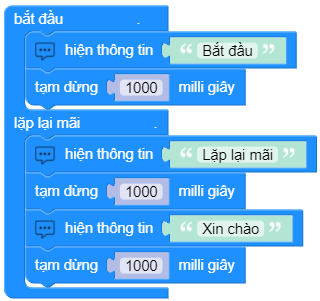

while True:
==========

Vòng lặp chính của chương trình:

    - Các thao tác nằm trong khối **bắt đầu** chỉ thực hiện 1 lần khi chương trình bắt đầu.
    - Các thao tác nằm trong khối **lặp lại mãi** sẽ lặp lại liên tục.

.. image:: images/basic-8.png
    :scale: 100 %
    :align: center

Ví dụ:
----------------------

