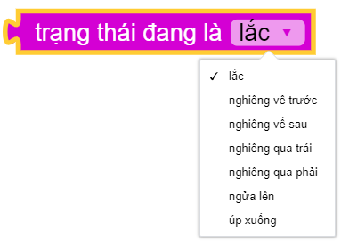
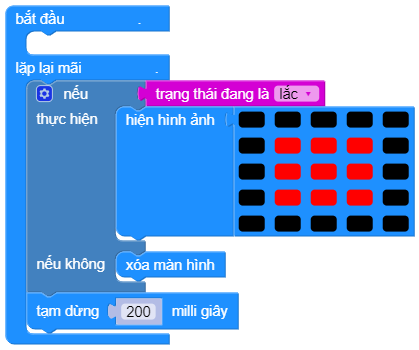

accelerometer.is_gesture(status)
==========

Trả về giá trị ``True`` khi cảm biến gia tốc phát hiện Yolo:Bit đang được:

    - Lắc
    - Nghiêng về trước
    - Nghiêng về sau
    - Nghiêng qua trái
    - Nghiêng qua phải
    - Ngửa lên
    - Úp xuống

Ví dụ:
----------------------

