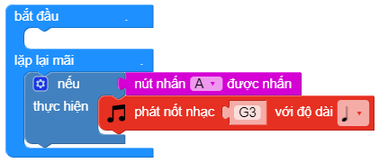

If...
==========

Nếu như điều kiện đúng thì thực hiện các lệnh.

.. image:: images/logic-1.png
    :scale: 100 %
    :align: center

Bạn có thể thêm nhiều điều kiện và đầu ra tương ứng bằng cách nhấn vào ""Cài đặt""

.. image:: images/logic-1-1.png
    :scale: 100 %
    :align: center

Ví dụ:
----------------------

Sử dụng khối ""nếu..."" để phát âm thanh khi nút được nhấn.

