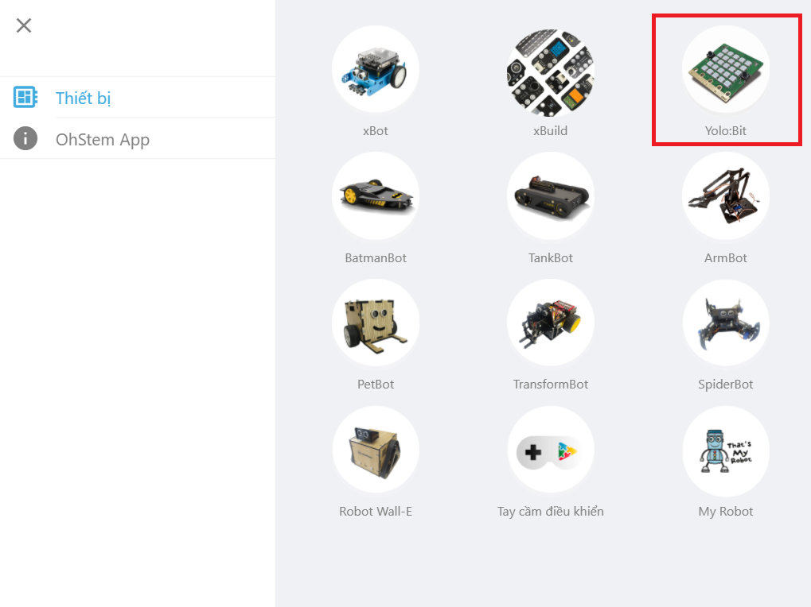
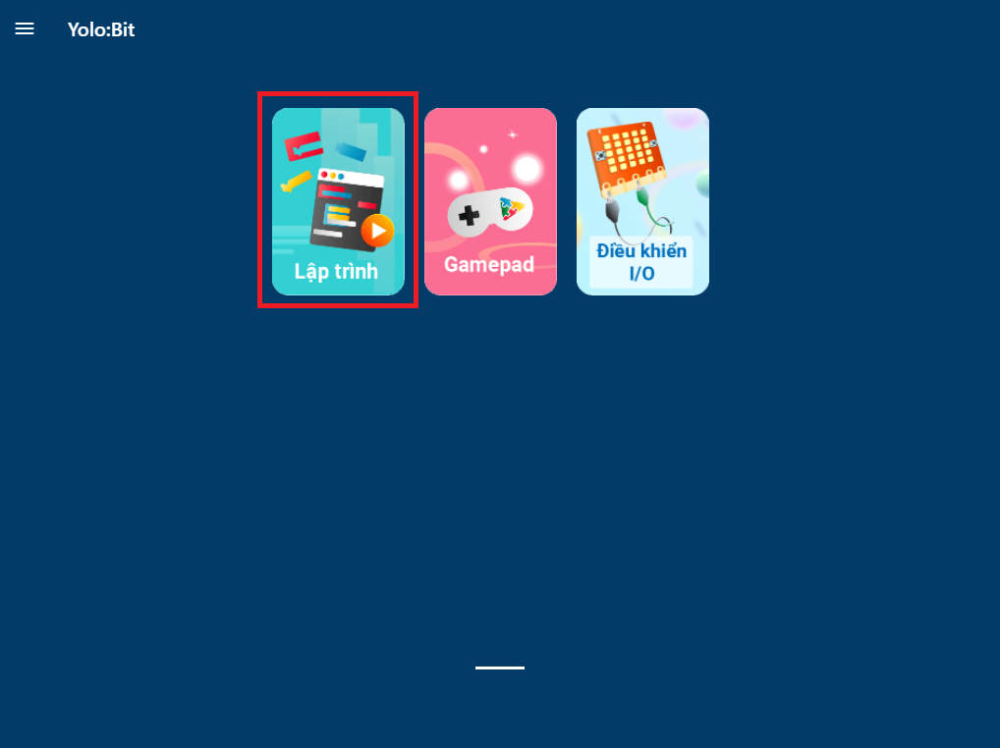
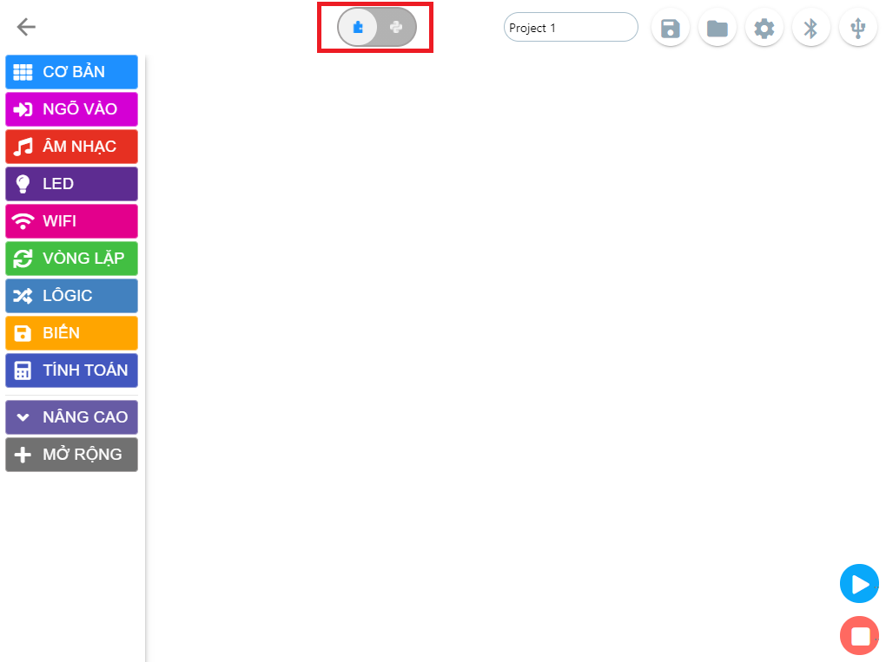

Công cụ lập trình
=============================================

Công cụ lập trình chúng ta sẽ sử dụng là Ohstem App. Công cụ này hỗ trợ cả 2 chế độ dạng khối kéo thả và dạng text sử dụng MicroPython. Để viết chương trình cho Yolo:Bit, bạn truy cập vào trang `Phần mềm Ohstem App <https://app.ohstem.vn/>`_

Sau khi vào trang web, chọn thiết bị là Yolo:Bit

chọn *Lập trình* để viết một chương trình mới cho Yolo:Bit.

Giao diện lập trình mặc định sẽ là lập trình khối kéo thả. Bạn sử dụng menu trên cùng ở giữa màn hình để chuyển đổi qua lại giữa chế độ khối kéo thả và lập trình dạng text bằng cách nhấn vào tên chế độ (BLOCK hay PYTHON). Chế độ lập trình dạng text MicroPython sẽ như sau:

.. image:: images/use-3.png
    :width: 600
    :align: center

Về cách kết nối thiết bị, các chức năng quản lý tệp, bật màn hình Serial đều tương tự khi sử dụng Kéo thả nên cả bạn xem kỹ ở phần ``Phần mềm Ohstem App`` nhé.

Chúng ta sẽ bắt đầu tìm hiểu cách viết chương trình trong các phần sau.