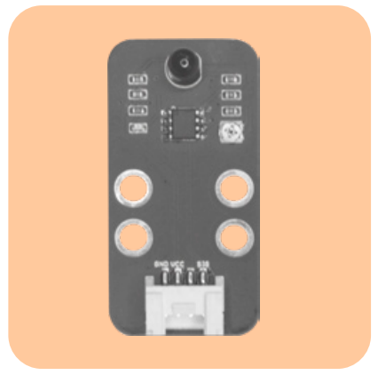
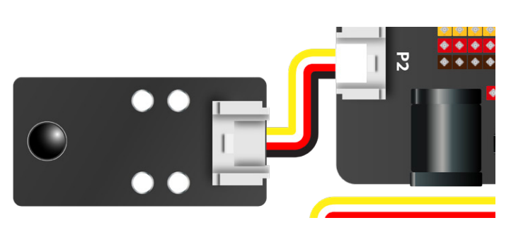
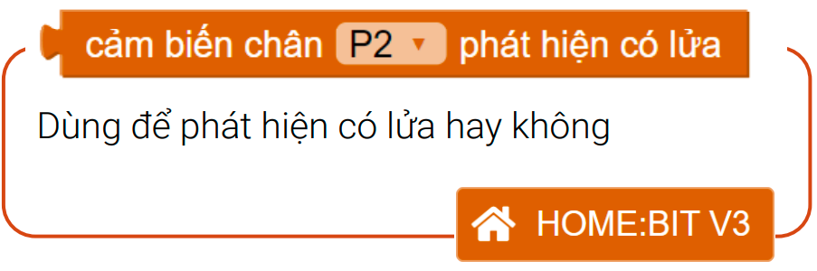
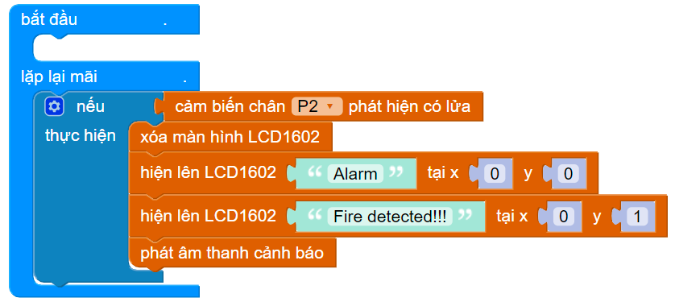

11. Bài 8: Cảnh báo cháy
=====================================

Mục tiêu
--------------------
--------------------

Trong bài này, chúng ta sẽ sử dụng cảm biến lửa để phát hiện có lửa cháy hay không, từ đó hiển thị lên màn hình LCD và phát ra âm thanh cảnh báo.

Thiết bị cần dùng
----------------------
----------------------

- Cảm biến lửa 

|   

Kết nối
------------------------
------------------------

- Kết nối cảm biến lửa vào cổng P2

|   

Giới thiệu khối lệnh
------------------------
------------------------

| 

Viết chương trình
-----------------------
-----------------------

1. Tạo điều kiện: Nếu cảm biến chân P2 phát hiện
ra lửa

|   
2. Khi phát hiện có lửa, chương trình bắt đầu xóa màn hình LCD trước đó, hiện 2 dòng chữ “Alarm - Fire detected!!!” lên LCD và phát ra âm thanh cảnh báo.

|   

Chương trình mẫu
---------------------
---------------------

- Cảnh báo cháy: `Tại đây <https://app.ohstem.vn/#!/share/yolobit/2CycT2NG5NsIFWkXyDA4e1F1rmU>`_

|

