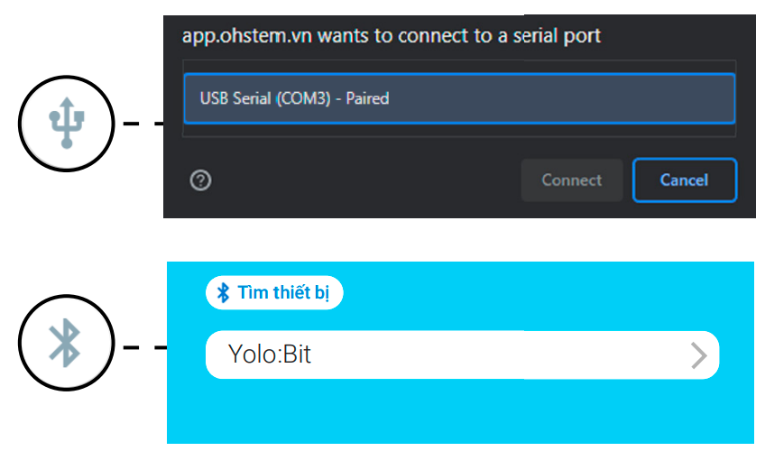

3. Cài đặt thư viện Home:Bit V3
=========================================

Cài đặt thư viện 
----------------
------------------

Để lập trình Home:Bit, bạn cần cài đặt thư viện. Các bước thực hiện như sau:

1. Truy cập OhStem App tại `<app.ohstem.vn>`_ hoặc tải OhStem App trên Google Play / App Store

|
2. Chọn thiết bị Yolo:Bit

.. image:: Images/homebit_16.png
    :width: 500px
    :align: center 
|
3. Chọn menu Lập trình

.. image:: Images/homebit_17.png
    :width: 500px
    :align: center 
|

4. Chọn mục “Mở rộng” và chọn thư viện mở rộng HOME:BIT V3

|
5. Kết nối OhStem App với Yolo:Bit

|
6. Sau khi tải thư viện xong, trong danh mục khối lệnh bên trái sẽ xuất hiện HOME:BIT V3

|

Chương trình mẫu 
-------------
----------------

Trước khi tìm hiểu cách tự lập trình, bạn có thể tải và chạy chương trình hoàn thiện của Home:Bit để trải nghiệm toàn bộ các tính năng của bộ kit qua đường dẫn sau:

|

Chương trình này đã có đầy đủ tính năng:

    1. Điều khiển bật tắt, thay đổi độ sáng của đèn LED trên Yolo:Bit bằng remote
    2. Phát ra âm thanh cảnh báo khi phát hiện có người (khi chế độ cảnh báo được bật bằng nút A trên Yolo:Bit)
    3. Hiển thị nhiệt độ, độ ẩm lên màn hình OLED
    4. Khóa cửa bằng mật mã, khi nhập đúng mật mã là “AABB” thì cửa sẽ tự mở (Nhấn nút A, nút B trên Yolo:Bit để tiến hành nhập mật khẩu)
    5. Khi trời tối và phát hiện có người, đèn cổng (4 đèn LED RGB) sẽ tự bật
    6. Khi phát hiện bị cháy, Yolo:Bit sẽ hiện thông tin cảnh báo lên màn hình OLED và phát ra âm thanh báo động.
    7. Khi phát hiện động đất (ngôi nhà bị rung, lắc), Yolo:Bit sẽ hiện thông tin cảnh báo lên OLED và phát ra âm thanh báo động
