2. Hướng dẫn lắp ráp Home:Bit 
===============================

Trước khi lắp ráp, bạn cần căn chỉnh Servo về góc 0 để thực hiện chính xác. Thực hiện như sau:

1. Kết nối Servo vào chân P6 trên mạch mở rộng đã gắn trên Yolo:Bit
   
2. Kết nối Yolo:Bit với OhStem App và tiến hành lập trình 

3. Tạo chương trình như hình minh họa và nhấn nút chạy 

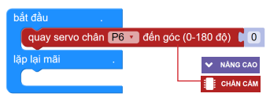
|
Lắp ráp
-----------
------------

1. Lắp cánh cửa

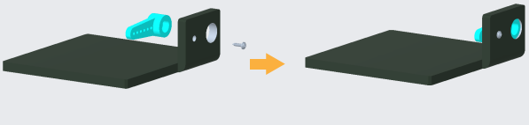
|
2. Lắp Servo vào cửa

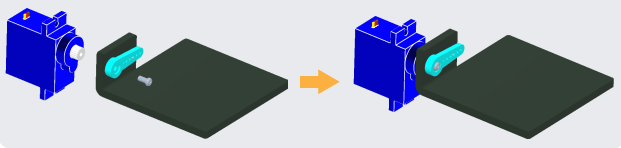
|

3. Lắp bộ cánh cửa vào tấm mặt trước

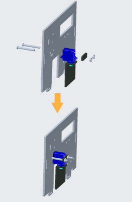
|
4. Lắp màn hình vào tấm mặt trước

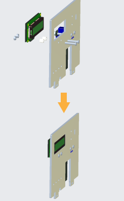
|
5. Lắp các module còn lại vào mặt trước

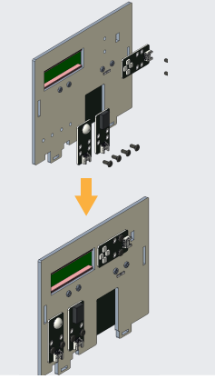
|
6. Lắp 4 tấm tường xung quanh

.. image:: Images/homebit_9.png
    :scale: 100%
    :align: center
|
7. Lắp tấm đáy vào thân nhà

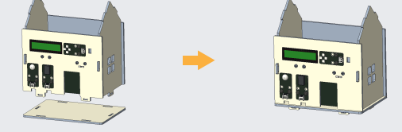
|
8. Lắp các chốt cố định (tổng cộng 10 chốt)

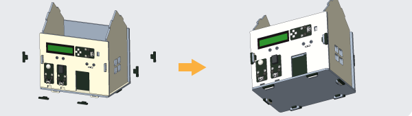
|
9.  Lắp các module và mạch mở rộng lên tấm mái trước

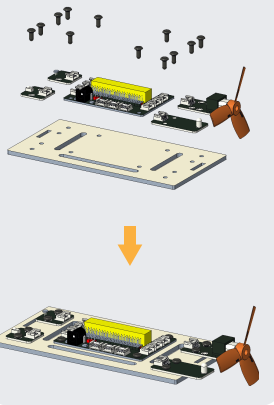
|
10. Lắp 2 tấm mái vào thân nhà

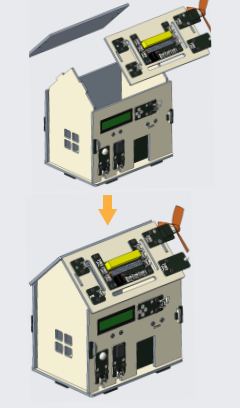
|
Sơ đồ kết nối
------------
-----------------

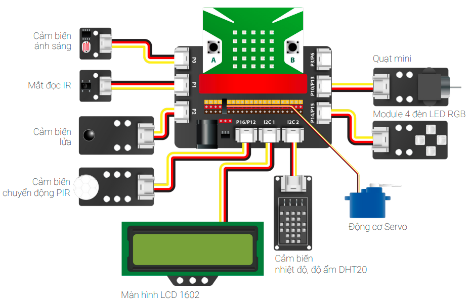
