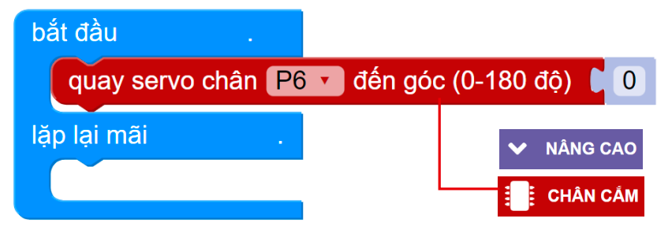

2. Hướng dẫn lắp ráp Home:Bit 
===============================

Trước khi lắp ráp, bạn cần căn chỉnh Servo về góc 0 để thực hiện chính xác. Thực hiện như sau:

1. Kết nối Servo vào chân P6 trên mạch mở rộng đã gắn trên Yolo:Bit
   
2. Kết nối Yolo:Bit với OhStem App và tiến hành lập trình 

3. Tạo chương trình như hình minh họa và nhấn nút chạy 

|
Lắp ráp
-----------
------------

1. Lắp cánh cửa

|
2. Lắp Servo vào cửa

.. image:: Images/homebit_5.png
    :scale: 100%
    :align: center
|

3. Lắp bộ cánh cửa vào tấm mặt trước

.. image:: Images/homebit_6.png
    :scale: 100%
    :align: center
|
4. Lắp màn hình vào tấm mặt trước

|
5. Lắp các module còn lại vào mặt trước

.. image:: Images/homebit_8.png
    :scale: 100%
    :align: center
|
6. Lắp 4 tấm tường xung quanh

.. image:: Images/homebit_9.png
    :scale: 100%
    :align: center
|
7. Lắp tấm đáy vào thân nhà

|
8. Lắp các chốt cố định (tổng cộng 10 chốt)

.. image:: Images/homebit_11.png
    :scale: 100%
    :align: center
|
9.  Lắp các module và mạch mở rộng lên tấm mái trước

.. image:: Images/homebit_12.png
    :scale: 100%
    :align: center
|
10. Lắp 2 tấm mái vào thân nhà

.. image:: Images/homebit_13.png
    :scale: 100%
    :align: center
|
Sơ đồ kết nối
------------
-----------------

.. image:: Images/homebit_14.png
    :width: 600px
    :align: center
