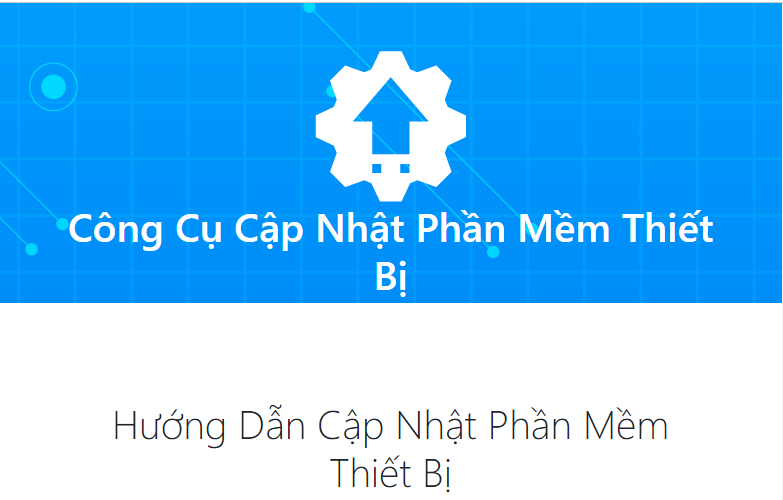
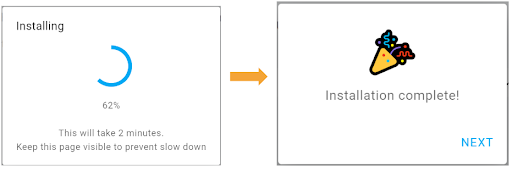

2. Hướng dẫn cập nhật firmware (dành cho phiên bản Yolo:Bit version 5)
===========

Phần mềm bên trong Yolo:Bit (firmware) thường xuyên được cập nhật và nâng cấp, với phiên bản Yolo:Bit version 5 sẽ có 1 số điểm cập nhật mới khi thao tác cập nhật firmware. 

Các bước thực hiện: 

- Bước 1: Truy cập vào link `<https://fw.ohstem.vn/>`_. Giao diện hiển thị như hình:

|

- Bước 2: Kết nối mạch Yolo:Bit với laptop bằng dây USB Type C. 

|

- Bước 3: **Nhấn và giữ nút B** trên Yolo:Bit, **trong lúc đó nhấn nút Reset (phía sau Yolo:Bit) và thả ra sau 1 giây**, **sau đó mới thả nút B** để thiết bị vào trạng thái sẵn sàng cập nhật firmware: 

..  image:: image/fw_3.gif
    :scale: 100%
    :align: center 
|
- Bước 4: Chọn firmware cần cập nhật là **Yolo:Bit S3 v1.x**, chọn cổng kết nối có tên là **USB/JTAG serial...** và nhấn **Cập nhật**

    Firmware sẽ được cập nhật liên tục, do đó bạn hãy chọn bản cập nhất mới nhất, ví dụ trong hình là v1.14

- Bước 5: Chọn **Install** để tiếp tục cập nhật firmware 

|

- Bước 6: Chờ khoảng 2 phút để cập nhật. Màn hình hiển thị cập nhật thành công như hình: 

|

- Bước 7: **Nhấn nút Reset** và thoát khỏi trang web cập nhật firmware và tiến hành lập trình.
