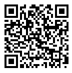

5. Bài 3: Nút nhấn giữ
==================================

Giới thiệu
-----------
-----------------

Nút nhấn giữ, sau khi được nhấn sẽ giữ nguyên trạng thái và sẽ đổi lại trạng thái ban đầu khi được nhấn thêm lần nữa.

    .. image:: images/2_2.png
        :width: 300px
        :align: center 
    |

Xây dụng mạch điện 
------------
-----------

- **Thành phần:**

    - Đèn LED đỏ. 
    - Điện trở R1 100 Ω. 
    - Nút nhấn giữ S1.

- **Sơ đồ mạch điện**

    .. image:: images/bai_3.1.png
        :width: 600px
        :align: center 
    |
- **Nguyên lý hoạt động:**

Tương tự như **Bài 2**, tuy nhiên thay vì thả nút nhấn ra không nhấn nữa để tắt LED như 
ở bài 2 thì ta cần nhấn thêm 1 lần nữa để đổi trạng thái của nút nhấn.

Kết nối mạch điện 
-----------
-------------

Nhấn S1 LED sáng, nhấn thêm cái nữa LED tắt.

    .. image:: images/bai_3.2.png
        :width: 500px
        :align: center 
    |

Chương trình
---------
-----------------

- Chúng ta sẽ sử dụng lại chương trình trong Bài 2. 
    
    - Chân P1 sẽ dùng để phát hiện trạng thái của nút nhấn giữ. 
    - Nếu nút đang được nhấn thì sẽ dùng chân P0 để bật đèn LED. 
    - Ngược lại nếu nút đang được ngắt thì sẽ tắt đèn LED

    .. image:: images/2.3.png
        :width: 1000px
        :align: center 
    |

Kết quả
----------
---------------

Kết quả của chương trình như sau: 

    .. image:: images/bai_3.3.png
        :width: 600px
        :align: center 
    |

Có thể bạn chưa biết? 
-----------
-------------

Để kiểm soát hoạt động của một thiết bị, nút nhấn và công tắc là những thành phần không thể thiếu. Phụ thuộc vào mục đích kiểm soát khác nhau mà có rất nhiều loại công tắc đấy các bạn, sau đây là một vài ví dụ:

- Nút nhấn đa hướng 

    .. image:: images/3.2.png
        :width: 200px
        :align: center 
    |
- Công tắc lật 

    .. image:: images/3.3.png
        :width: 200px
        :align: center 
    |
- Công tắc xoay

    .. image:: images/3.4.png
        :width: 200px
        :align: center 
    |
- Công tắc chuyển mạch

    .. image:: images/3.5.png
        :width: 200px
        :align: center 
    |

Chương trình mẫu
--------------
-------------------

- Nút nhấn giữ: `Tại đây <https://app.ohstem.vn/#!/share/yolobit/2Bvdajf3k2cda4pfLbd8fP2mgDQ>`_

