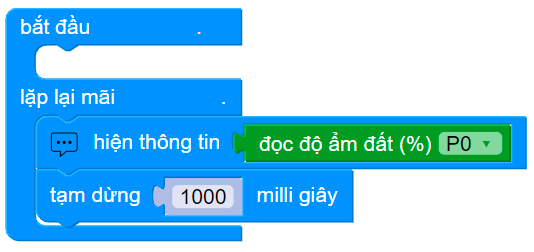

4. Bài 1: Hiển thị độ ẩm đất
=================================

Mục tiêu
----------------------
----------------------

Độ ẩm đất là yếu tố ảnh hưởng lớn đến sự phát triển của cây trồng. Trong dự án đầu tiên, chúng ta sẽ đo lường và hiển thị giá trị này lên OhStem App nhé!

Thiết bị cần dùng
--------------------
--------------------

- Cảm biến độ ẩm đất

|
- Mạch mở rộng gắn sẵn Yolo:Bit

.. image:: Images/planbit_31.png
    :width: 200px
    :align: center
|

Kết nối
---------------------
---------------------

- Kết nối **cảm biến độ ẩm đất** vào cổng P0

|

Giới thiệu khối lệnh
---------------------
---------------------

.. image:: Images/planbit_33.png
    :width: 800px
    :align: center  
|

|

Viết chương trình
---------------------
---------------------

1. Kéo thả **khối lệnh hiện thông tin** vào phần lặp lại mãi mãi

|
2. Kéo thả **khối lệnh đọc độ ẩm đất** vào **khối lệnh hiện thông tin**. Sau đó thêm **khối lệnh tạm dừng** với thời gian là 1000ms (1 giây)

|

Chương trình mẫu
---------------------
---------------------

- Hiển thị độ ẩm đất: `Tại đây <https://app.ohstem.vn/#!/share/yolobit/2CyiDbVHc6DhJYUmGWGENE28dCC>`_

.. image:: Images/planbit_37.png
    :width: 200px
    :align: center
|
