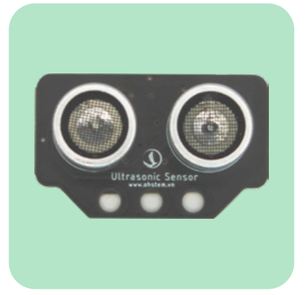
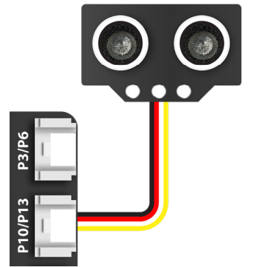
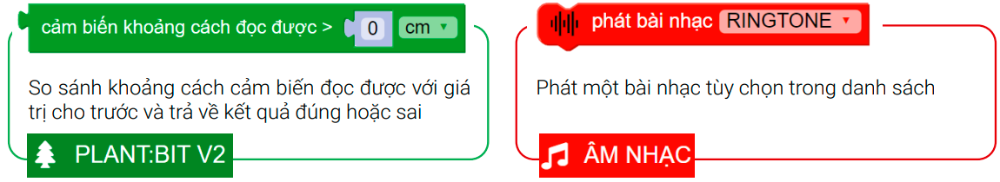
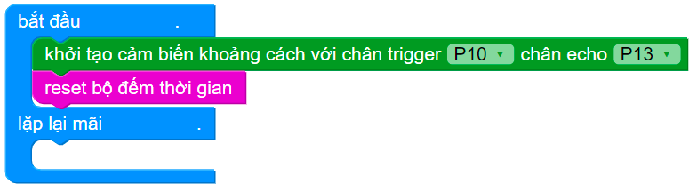
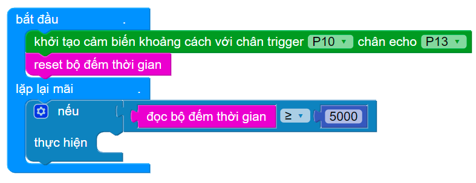
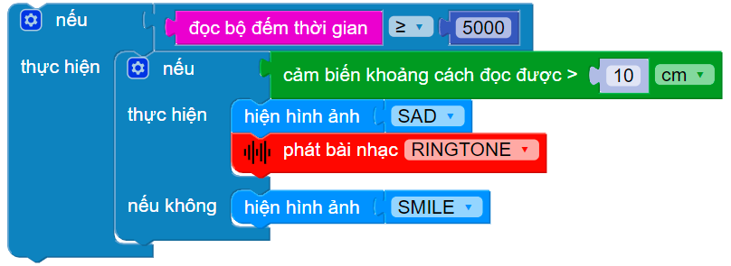
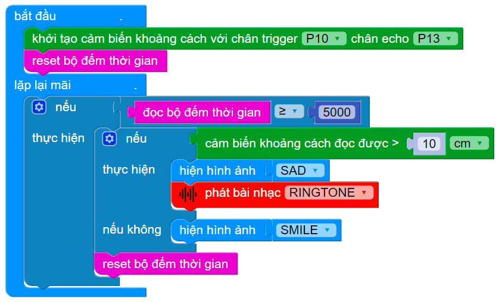

13. Bài 10: Cảnh báo mực nước 
====================================

Mục tiêu
------------------
-----------------

Ở bài học này, chúng ta sẽ thực hiện chương trình kiểm tra mực nước trong bể chứa và bật đèn LED Yolo:Bit để cảnh báo: hiển thị mặt cười khi bể còn nước, hiển thị mặt buồn và phát âm thanh báo động khi nước trong bể cạn.

Thiết bị cần dùng
---------------
---------------

- Mạch mở rộng gắn sẵn Yolo:Bit

|
- Cảm biến khoảng cách 

|

Kết nối
----------------
----------------

- Cảm biến khoảng cách nối vào chân P10/P13

|

Giới thiệu khối lệnh
-----------------
----------------

|

Viết chương trình
-------------------
-------------------

1. Khởi tạo màn hình cảm biến khoảng cách và Reset bộ đếm thời gian

|
2. Tạo điều kiện: Nếu bộ đếm thời gian lớn hơn 5 giây

|
3. Lồng một điều kiện bên trong:

- Nếu cảm biến khoảng cách đọc được > 10cm (nước cạn), hiện mặt buồn và phát chuông báo

- Nếu không, hiện mặt vui

|
4. Đặt lại bộ đếm thời gian

|

Chương trình mẫu
---------------------
---------------------

- Cảnh báo mực nước : `Tại đây <https://app.ohstem.vn/#!/share/yolobit/2Cyux73I7ZbVzygW90HtSUem1zC>`_

|
