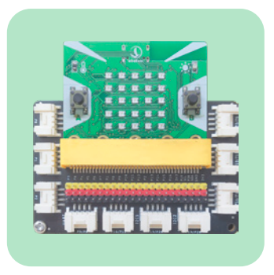
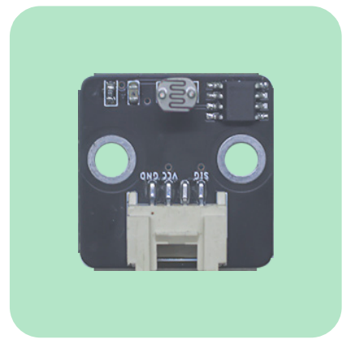
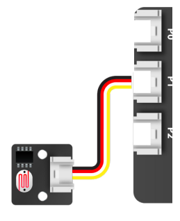
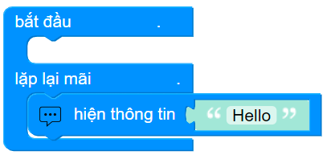
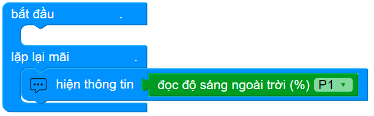
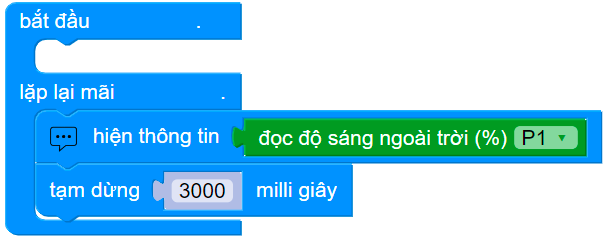
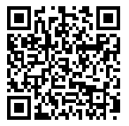

10. Bài 7: Hiển thị độ sáng
========================================

Mục tiêu
--------------------
--------------------

Độ sáng môi trường sẽ ảnh hưởng lớn tới quá trình quang hợp và phát triển của cây trồng. Trong bài này, chúng ta sẽ đo lường và hiển thị giá trị độ sáng môi trường lên OhStem App nhé!

Thiết bị cần dùng
--------------------
--------------------

- Mạch mở rộng gắn sẵn Yolo:Bit

|
- Cảm biến ánh sáng

|

Kết nối
--------------------
---------------------

- Cảm biến ánh sáng nối vào chân P1

|

Viết chương trình
---------------------
---------------------

1. Bắt đầu với khối lệnh hiện thông tin nằm trong lệnh lặp lại mãi

|
2. Kéo thả khối lệnh đọc độ sáng vào khối lệnh hiện thông tin và chọn chân là P1

|
3. Đặt thời gian chờ cập nhật lại độ sáng đo được là 3 giây

|
**Lưu ý**: Chọn **Hiển thị cửa sổ thông tin** trong mục **Cài đặt** để xem được thông tin hiển thị

Chương trình mẫu
---------------------
---------------------

- Hiển thị độ sáng: `Tại đây <https://app.ohstem.vn/#!/share/yolobit/2Cyrr2O6jyWPP6TnEGyX8WJr54S>`_

|

