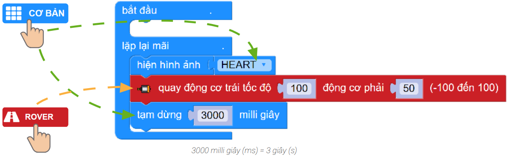
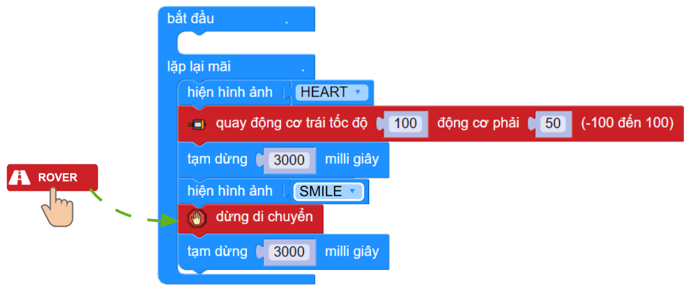

6. Bài 2: Chú ý từng bước đi
===================================

*Chuyến đi của Rover đã bắt đầu rồi. Hãy nhắc nhở Rover chú ý đến bánh xe mỗi bên của mình vì chúng không thực sự đồng đều đâu. Cùng Rover kiểm tra mỗi động cơ để đạt hành trình tuyệt vời nhé!*

Mục tiêu
---------------------
------------------------------

- Hiểu được cách điều khiển từng động cơ.

Giới thiệu khối lệnh
---------------
------------------

- Khối lệnh hiện hình ảnh:

    .. image:: images/bai_2.1.png
        :width: 400px
        :align: center
    

- Khối lệnh tạm dừng:

    .. image:: images/bai_2.2.png
        :width: 400px
        :align: center

- Khối lệnh điều khiển động cơ:
    
    .. image:: images/bai_2.3.png
        :width: 1100px
        :align: center

Cơ chế hoạt động
----------------------
-----------------------

Rover di chuyển nhờ sự hoạt động của 2 động cơ bên trái và phải. Vậy nếu 2 động cơ này đồng thời có chế độ hoạt động khác  nhau thì sẽ ra sao? Dưới đây là một số trường hợp di chuyển của 2 động cơ:

    - 2 động cơ quay cùng chiều, cùng tốc độ:

        - Nếu > 0: Tiến tới
        - Nếu < 0: Lùi lại
        - Nếu = 0: Đứng yên

    .. image:: images/bai_2.4.png
        :width: 200px
        :align: center 

    - 2 động cơ quay cùng chiều, khác tốc độ:

        - Động cơ trái > Động cơ phải: Rẽ phải
        - Động cơ phải > Động cơ trái: Rẽ trái

    .. image:: images/bai_2.5.png
        :width: 200px
        :align: center
    
    
    - 2 động cơ quay khác chiều, cùng tốc độ: Xoay tại chỗ 

    .. image:: images/bai_2.6.png
        :width: 200px
        :align: center
    
    

Viết chương trình 
---------------------------
-------------------------

1. Hiển thị hình ảnh trái tim và cho Rover xoay hình tròn (tốc độ động cơ phải bằng một nửa của động cơ trái) trong 3 giây

|   
2. Hiển thị hình ảnh mặt cười và dừng di chuyển trong 3 giây

