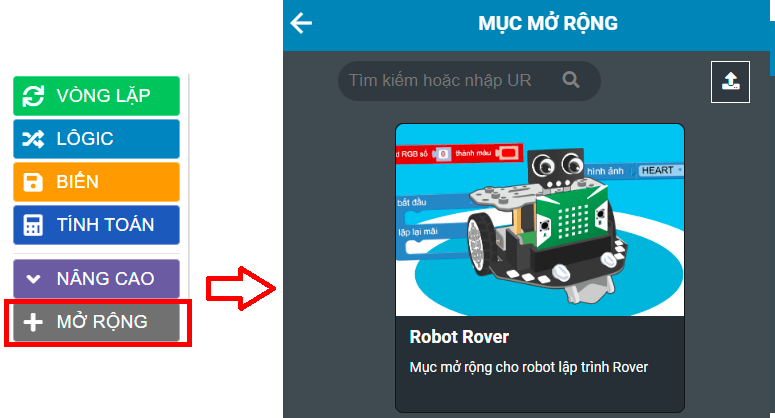

3. Cài đặt thư viện 
============================

Để lập trình điều khiển Rover, bạn cần cài đặt thư viện, thực hiện như sau: 

1. Chọn mục "Mở rộng" và tải thư viện mở rộng ROVER

|

2. Trong danh mục khối lệnh bên trái sẽ xuất hiện “ROVER”

|

Các chế độ mặc định 
===================================

- Sau khi tải và cài đặt thư viện Rover vào Yolo:Bit, **RESET lại robot**.

- Khi có âm thanh và đèn sáng, **Robot có sẵn 4 chế độ hoạt động**

.. image:: images/bai_1.3.png
    :width: 800px
    :align: center

- **Nhấn vào nút A** trên Yolo:Bit để đổi chế độ

**Lưu ý:** Nếu muốn nạp lại chương trình mặc định cho Rover, chỉ cần tải lại thư viện Rover thì sẽ có lại chương trình mặc định này. 
