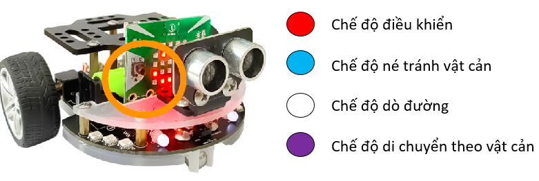

4. Các chế độ mặc định 
===================================

Sau khi tải và cài đặt thư viện Rover vào Yolo:Bit, Rover sẽ nhận được một chương trình mặc định có 4 chế độ. Với mỗi chế độ, đèn LED RGB sẽ sáng màu tương ứng:

|