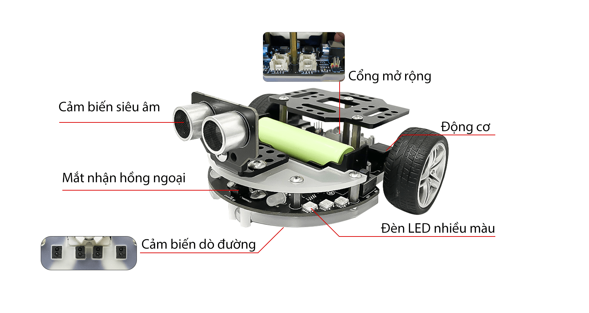

1. Giới thiệu về robot Rover 
============================

**1.1 Robot Rover là gì?**

--------------------------------

Robot Rover là xe lập trình điều khiển thông minh, được thiết kế để ứng dụng vào giảng dạy STEM cho học sinh và người
mới bắt đầu học lập trình. Bộ Kit này sẽ là công cụ giúp trẻ phát triển tư duy sáng tạo và trí tuệ hiệu quả. Thông qua phương
pháp lập trình kéo thả khối lệnh đơn giản, chúng ta có thể xây dựng nhiều tính năng thú vị và độc đáo cho Robot Rover.

**1.2 Hình ảnh**

--------------------------

    .. image:: images/rover_1.1.png
        :width: 400px
        :align: center 
    |

**1.3 Tham số**

---------------

====================================== =========================== 
    **Tên**                                     **Tham số**
 Điện áp                                    3.3 V
 Kích thước                                 130mm x 140mm x 70mm
 Điều khiển hồng ngoại                      Kết nối với P4 
 Đèn RGB WS2812B                            6 x RGB kết nối với P6
 LED trắng                                  2 Led 5mmm kết nối với I2C 
 Kết nối                                    Cổng IIC (P19, P20), Cổng Servo (S1-P16, S2-P3), Cổng siêu âm (Ultrasonic) (P13-P14), P0, P1 
 Động cơ                                    Động cơ giảm tốc vi bánh răng GA12-N20 DC (145 vòng / phút)
 Cảm biến siêu âm                           HC-SR04 (phát hiện khoảng cách không tiếp xúc 2cm-200cm, độ chính xác ± 1.5mm)
 Cảm biến dò đường                          4 x mắt đọc
====================================== ===========================

**1.4 Giới thiệu các Mô - đun chính của Rover**
>>>>>>> Stashed changes

------------------------------------

