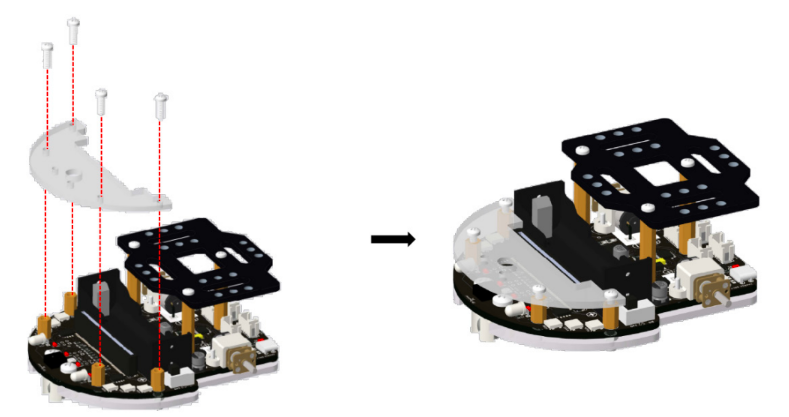
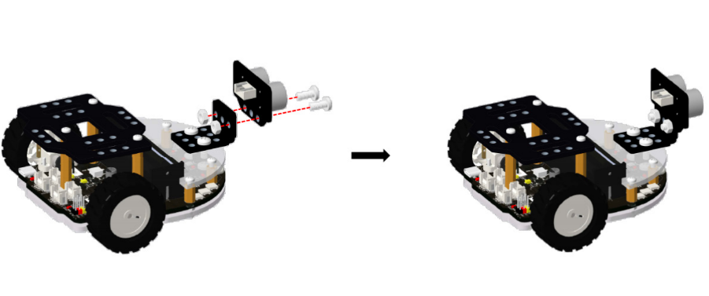
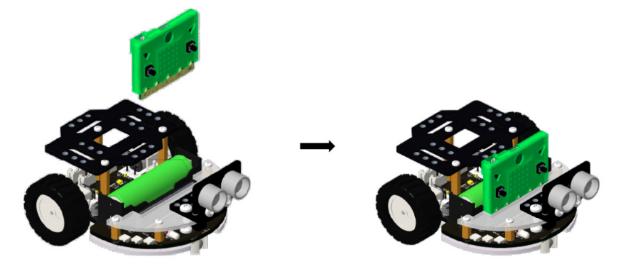
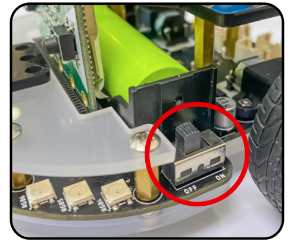

2. Hướng dẫn lắp ráp
======================================

**2.1 Lắp ráp**

----------------------------------------------

1. Lắp bánh đa hướng

|
2. Lắp bu lông M3-10 và đai ốc M3 vào tắm mica dưới

.. image:: images/rover_3.png
    :scale: 70%
    :align: center  
|
3. Lắp tấm mica dưới vào bo mạch chính

|
4. Lắp trụ đồng M3-10 vào 4 vị trí như hình

.. image:: images/rover_5.png
    :scale: 70%
    :align: center 
|
5. Lắp trụ đồng M3-30 vào 3 vị trí như hình

|
6. Lắp tấm mở rộng lên thân robot bằng bu lông M3-10

.. image:: images/rover_7.png
    :scale: 70%
    :align: center 
|
7. Lắp tấm sau vào mạch điều khiển ở vị trí như hình bằng bu lông M3-10

|
8. Lắp 2 bánh xe sau vào trục động cơ của robot

.. image:: images/rover_9.png
    :scale: 70%
    :align: center 
|
9. Lắp gá chữ L vào vị trí như hình bằng bu lông M4 -10

.. image:: images/rover_10.png
    :scale: 70%
    :align: center 
|
10. Lắp cảm biến siêu âm vào vị trí như hình bằng bu lông M4-10 và đai ốc M4

|
11. Lắp pin vào vị trí như hình. Chú ý lắp pin đúng cực tránh hư hỏng robot

.. image:: images/rover_12.png
    :scale: 70%
    :align: center 
|
12. Lắp dây tín hiệu nối cảm biến khoảng cách với mạch điều khiển tại vị trí như hình

.. image:: images/rover_13.png
    :scale: 70%
    :align: center 
|
13. Lắp máy tính lập trình Yolo:Bit vào robot

|

**2.2 Hướng dẫn sạc pin**

---------------------------------

**Pin trên rover**

Pin dùng cho Rover là pin sạc Li-ion 3.7V, có thể sạc được. Khi lắp vào robot Rover bạn cần để ý 
lắp đúng cực để tránh gây hư hại robot

**Sạc pin**

1. Tắt nguồn robot

|
2. Cắm đầu USB của dây cáp vào cốc sạc, cổng USB máy tính, laptop,...

|
3. Cắm cáp sạc USB - C vào cổng sạc ở phía sau xe 

|
4. Khi sạc đầy, đèn sạc sẽ tự động tắt

|

  **Lưu ý: Không nên để cắm sạc quá 3 tiếng hoặc qua đêm**

